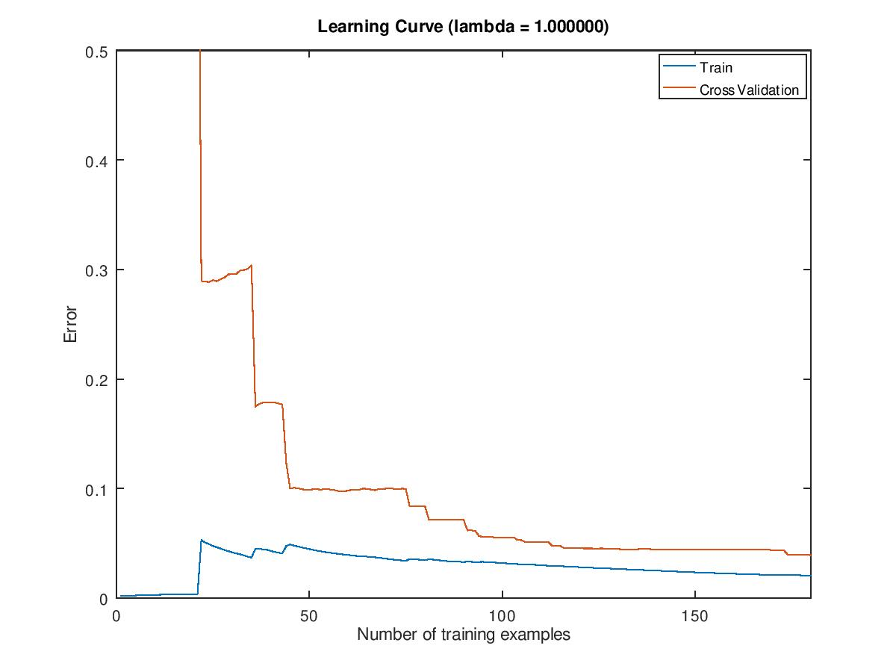
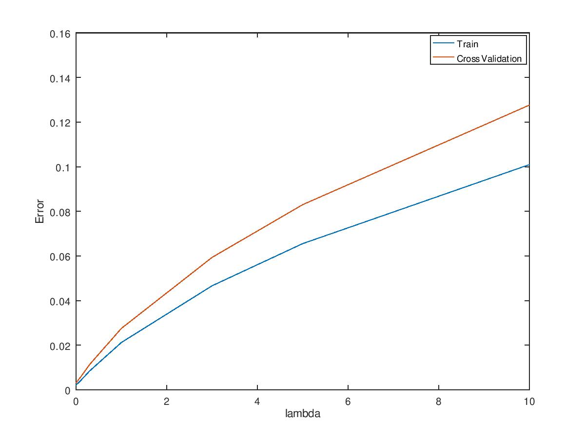

# Prototyping Information

The octave scripts require that you have the **io package installed on your system.**

Many of the concepts learnt through Andrew Ng's Machine Learning Course, are applied here.

The model is trained using the full mushrooms.csv data set in the 'train' script. It uses a 60:40 split for training data + test data to verify the models predictions.

The script 'train_withanalysis' performs the same type of training but on a smaller subset of data in mushrooms_test.csv and produces learning and validation curves. You can use the full data set for this plotting the entire process will be incredibly long.

For minimising the cost and generating theta values I opted to use gradient descent, this is mostly due to this project being a learning exercise for me and its easier to debug and visualise exactly what gradient descent is doing. Octave does have better optimisation functions (such as fminunc).

## Conclusions

Running the 'train' script trains a model that has >= 99% accuracy on the test set. The learning algorithm makes use of logistic regression. Due to the high accuracy on the test set no other learning algorithms, neural network etc, need to be considered. A learning rate (alpha) of one also gives this accuracy, so no further testing with different learning rates was done.

Using a smaller subset of the data in the 'train_withanalysis' scripts produces the below learning curve and validation curve.

The above graphs are produced similarly if ran with the full data set. The validation curve results make it seem likely that the decision boundary learnt by the model is good without any need for drastically altering lambda. As a very small or zero'd lambda term doesn't lead to a drastic error in the cross validation  curve, in fact it mimics the training curve closely. So, with this information the lambda term has been set to one.

The learning curve also shows that at a large enough dataset size both the error in the cross validation set and training set are small and become similar. So the model doesn't seem to likely suffer from high variance or high bias.

## Summary

From prototyping, the general process for this learning algorithm can be summarised as:

1. Pre-process data using label encoding and then one hot encoding. Remove first column (corresponds to one hot encoding of mushroom is edible).
2. Split data into training set, cross validation set, test set. Separate X and y values.
3. Code learning algorithm, using logistic regression to calculate the cost function and then using gradient descent or another optimised function to minimise the cost and produce theta values.
4. Perform analysis (cross validation curve, learning curve) to optimize parameters, diagnose high bias/high variance.
5. Train model using coded learning algorithm and optimised parameters .
6. Calculate accuracy of the model by testing its predictions against the test set.